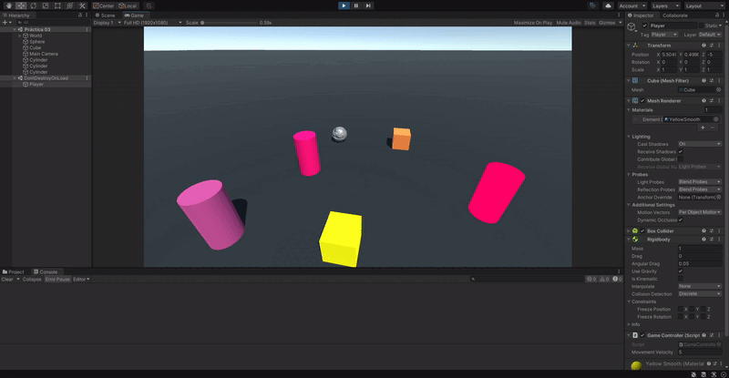
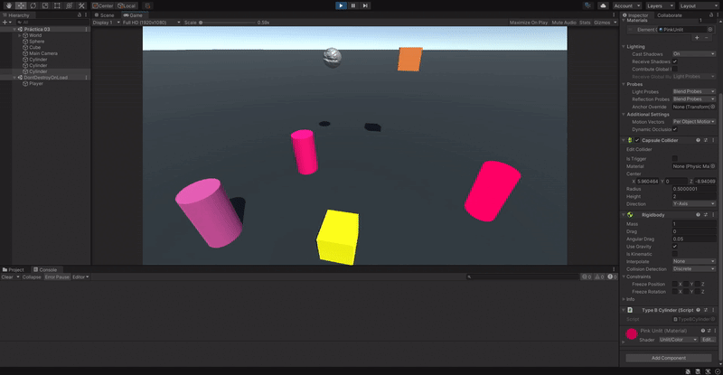
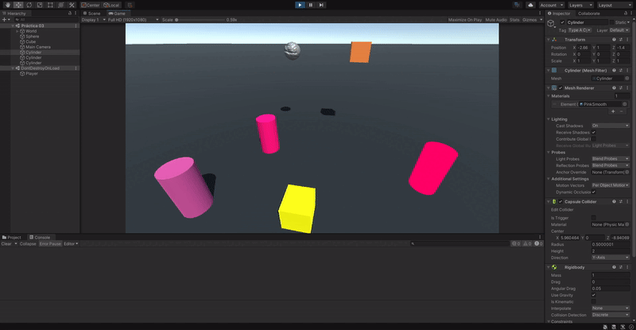
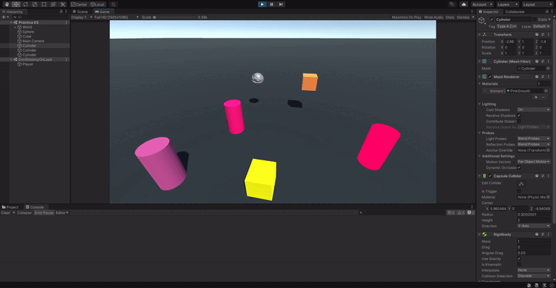

# Práctica 3

1. Implementar un controlador que mueva el objeto con wasd.

Primero asignamos cada tecla a su respectivo eje de movimiento dentro de "Project Settings", en la sección del "Imput Manager" y luego, en el script, declaramos una variable para almacenar la velocidad de movimiento, obtenemos la información de los ejes de entrada, la procesamos y se la aplicamos a la posición del objeto a través del Rigidbody para simular correctamente las físicas del mismo. También declaramos la variable "controller" para comprobar que solo es creada una instancia de este ya que solo puede existir una por cada ejecución del programa.

```cs
public class GameController : MonoBehaviour {
  public static GameController controller;
  public float movementVelocity;

  void Start() {
    movementVelocity = 5.0f;
  }

  void FixedUpdate() {
    float xAxis = Input.GetAxis("xAxis"); // d(positive) - a(negative)
    float zAxis = Input.GetAxis("zAxis"); // w(positive) - s(negative)
    Vector3 movement = new Vector3(xAxis, 0.0f, zAxis) * movementVelocity;
    this.GetComponent<Rigidbody>()
        .MovePosition(this.transform.position + movement * Time.fixedDeltaTime);
  }

  void Awake() {
    if(controller == null) {
      controller = this;
      DontDestroyOnLoad(this);
    } else if (controller != this) {
      Destroy(gameObject);
    }
  }
}
```



2. Cuando el jugador colisiona con un objeto de tipo B, el objeto A mostrará un texto en una UI de Unity.

Primero declaramos la variable que va a almacenar el evento delegado y añadimos un método que va a ejecutar dicho evento cuando se produzca la colisión:

```cs
public class TypeBCylinder : MonoBehaviour{
  public delegate void OnCollisionDelegate();
  public static event OnCollisionDelegate OnCollisionLogEvent;

  void OnCollisionEnter(Collision other) {
    if (other.gameObject.name == "Player" && OnCollisionLogEvent != null) {
      OnCollisionLogEvent();
    }
  }
}
```

Y luego definimos el método que va a ser delegado y lo añadimos a la variable de eventos del objeto encargado de ejecutarlo:

```cs
public class TypeACylinder : MonoBehaviour {
  void Start() {
    TypeBCylinder.OnCollisionLogEvent += OnCollisionLog;
  }

  void OnCollisionLog() {
    Debug.Log("Collision on Type B Cylinder detected.");
  }

  void OnDisable() {
    TypeBCylinder.OnCollisionLogEvent -= OnCollisionLog;
  }
}
```



3. Cuando el jugador toca el objeto A se incrementará la fuerza del objeto B.

Al igual que en el ejercicio anterior, primero declaramos la variable que va a almacenar el evento delegado y añadimos un método que va a ejecutar dicho evento cuando se produzca la colisión:

```cs
public class TypeACylinder : MonoBehaviour {
  public delegate void OnCollisionDelegate(Collision other);
  public static event OnCollisionDelegate OnCollisionAddForceEvent;

  // ...

  void OnCollisionEnter(Collision other) {
    if (other.gameObject.name == "Player" && OnCollisionAddForceEvent != null) {
      OnCollisionAddForceEvent(other);
    }
  }

  // ...
}
```

Y luego definimos el método que va a ser delegado y lo añadimos a la variable de eventos del objeto encargado de ejecutarlo:

```cs
public class TypeBCylinder : MonoBehaviour{
  //...
  public float force;

  void Start() {
    TypeACylinder.OnCollisionAddForceEvent += OnCollisionAddForce;
    force = 10.0f;
  }

  // ...

  void OnCollisionAddForce(Collision other) {
    Vector3 direction = this.transform.position - other.transform.position;
    this.GetComponent<Rigidbody>().AddForce(direction * this.force);
  }

  void OnDisable() {
    TypeACylinder.OnCollisionAddForceEvent -= OnCollisionAddForce;
  }
}
```



4. Cuando el jugador se aproxima a los cilindros de tipo A, los cilindros de tipo B cambian su color y las esferas se orientan hacia un objetivo ubicado en la escena con ese propósito. Consultar información de la clase Vector3: LookAt, RotateTowards, ...

Para este ejercicio primero declaramos la variable que va a almacenar el evento delegado y añadimos a update un método que va a ejecutar dicho evento cuando se produzca el acercamiento:

```cs
public class TypeACylinder : MonoBehaviour {
  // ...
  public delegate void OnProximityDelegate(bool playerIsCloseToA);
  public static event OnProximityDelegate OnProximityAlertEvent;
  float minPlayerDistance;

  void Start() {
    // ...
    minPlayerDistance = 3.0f;
  }

  void FixedUpdate() {
    GameObject player = GameObject.FindGameObjectWithTag("Player");
    float playerDistance =
        Vector3.Distance(this.transform.position, player.transform.position);
    if (OnProximityAlertEvent != null) {
      OnProximityAlertEvent(playerDistance < minPlayerDistance);
    }
  }

  // ...
}
```

Y luego definimos los métodos que van a ser delegados y lo añadimos a las variables de eventos de los objetos encargados de ejecutarlos:

```cs
public class TypeBCylinder : MonoBehaviour{
  // ...
  public Color pink;
  public Color green;

  void Start() {
    // ...
    TypeACylinder.OnProximityAlertEvent += OnProximityChangeColor;
    pink = this.GetComponent<Renderer>().material.color;
    green = new Color(1, 1, 1) - pink;
  }

  // ...

  void OnProximityChangeColor(bool playerIsCloseToA) {
    if (playerIsCloseToA &&
        this.GetComponent<Renderer>().material.color == pink) {
      this.GetComponent<Renderer>().material.color = green;
    }
    if (!playerIsCloseToA &&
        this.GetComponent<Renderer>().material.color == green) {
      this.GetComponent<Renderer>().material.color = pink;
    }
  }

  void OnDisable() {
    // ...
    TypeACylinder.OnProximityAlertEvent -= OnProximityChangeColor;
  }
}
```

```cs
public class Sphere : MonoBehaviour {
  void Start() {
    TypeACylinder.OnProximityAlertEvent += OnProximityChangeDirection;
  }

  // ...

  void OnProximityChangeDirection(bool playerIsCloseToA) {
    if (playerIsCloseToA) {
      GameObject target = GameObject.FindGameObjectWithTag("Target To Look");
      this.transform.LookAt(target.transform);
    }
  }

  void OnDisable() {
    TypeACylinder.OnProximityAlertEvent -= OnProximityChangeDirection;
  }
}
```


